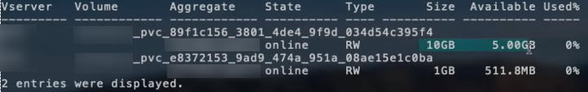

= ONTAP NAS-Konfigurationsoptionen und -Beispiele
:hardbreaks:
:allow-uri-read: 
:icons: font
:imagesdir: ../media/

Erfahren Sie, wie Sie mit Ihrer Installation von Astra Trident ONTAP NAS-Treiber erstellen und verwenden. Dieser Abschnitt enthält Beispiele für die Back-End-Konfiguration und Details zur Zuordnung von Back-Ends zu StorageClasses.

== Back-End-Konfigurationsoptionen

Die Back-End-Konfigurationsoptionen finden Sie in der folgenden Tabelle:

[cols="3"]
|===
| Parameter | Beschreibung | Standard 

| `version` |  | Immer 1 

| `storageDriverName` | Name des Speichertreibers | „ontap-nas“, „ontap-nas-Economy“, „ontap-nas-flexgroup“, „ontap-san“, „ontap-san-Economy“ 

| `backendName` | Benutzerdefinierter Name oder das Storage-Backend | Treibername + „_“ + DatenLIF 

| `managementLIF` | IP-Adresse eines Clusters oder SVM-Management-LIF für nahtlose MetroCluster-Umschaltung müssen Sie eine SVM-Management-LIF angeben. | „10.0.0.1“, „[2001:1234:abcd::fefe]“ 

| `dataLIF` | IP-Adresse des LIF-Protokolls. Verwenden Sie eckige Klammern für IPv6. Kann nicht aktualisiert werden, nachdem Sie sie festgelegt haben | Abgeleitet von der SVM, sofern angegeben 

| `autoExportPolicy` | Automatische Erstellung von Exportrichtlinien aktivieren und [Boolean] aktualisieren | Falsch 

| `autoExportCIDRs` | Liste der CIDRs, um die Kubernetes-Knoten-IPs gegen Wann zu filtern `autoExportPolicy` Ist aktiviert | [„0.0.0.0/0“, „:/0“]` 

| `labels` | Satz willkürlicher JSON-formatierter Etiketten für Volumes | „“ 

| `clientCertificate` | Base64-codierter Wert des Clientzertifikats. Wird für zertifikatbasierte Authentifizierung verwendet | „“ 

| `clientPrivateKey` | Base64-kodierte Wert des privaten Client-Schlüssels. Wird für zertifikatbasierte Authentifizierung verwendet | „“ 

| `trustedCACertificate` | Base64-kodierte Wert des vertrauenswürdigen CA-Zertifikats. Optional Wird für zertifikatbasierte Authentifizierung verwendet | „“ 

| `username` | Benutzername für die Verbindung mit dem Cluster/SVM. Wird für Anmeldeinformationsbasierte verwendet |  

| `password` | Passwort für die Verbindung mit dem Cluster/SVM Wird für Anmeldeinformationsbasierte verwendet |  

| `svm` | Zu verwendende Storage Virtual Machine | Abgeleitet wenn eine SVM `managementLIF` Angegeben ist 

| `igroupName` | Der Name der Initiatorgruppe für die zu verwendenden SAN Volumes | „Trident-<Backend-UUID>“ 

| `storagePrefix` | Das Präfix wird beim Bereitstellen neuer Volumes in der SVM verwendet. Kann nicht aktualisiert werden, nachdem Sie sie festgelegt haben | „Dreizack“ 

| `limitAggregateUsage` | Bereitstellung fehlgeschlagen, wenn die Nutzung über diesem Prozentsatz liegt. *Gilt nicht für Amazon FSX für ONTAP* | „“ (nicht standardmäßig durchgesetzt) 

| `limitVolumeSize` | Bereitstellung fehlgeschlagen, wenn die angeforderte Volume-Größe über diesem Wert liegt. | „“ (nicht standardmäßig durchgesetzt) 

| `lunsPerFlexvol` | Die maximale Anzahl an LUNs pro FlexVol muss im Bereich [50, 200] liegen. | „100“ 

| `debugTraceFlags` | Fehler-Flags bei der Fehlerbehebung beheben. Beispiel: { „API“:false, „Methode“:true} | Null 

| `nfsMountOptions` | Kommagetrennte Liste von NFS-Mount-Optionen | „“ 

| `qtreesPerFlexvol` | Maximale Ques pro FlexVol, muss im Bereich [50, 300] liegen | „200“ 

| `useREST` | Boolescher Parameter zur Verwendung von ONTAP REST-APIs. *Tech Preview* wird mit MetroCluster nicht unterstützt. | Falsch 
|===
[WARNING]
.<Code>useREST</Code> Überlegungen
====
* `useREST` Wird als **Tech-Vorschau bereitgestellt**, das für Testumgebungen und nicht für Produktions-Workloads empfohlen wird. Wenn eingestellt auf `true`, Astra Trident wird ONTAP REST APIs zur Kommunikation mit dem Backend verwenden. Diese Funktion erfordert ONTAP 9.10 und höher. Darüber hinaus muss die verwendete ONTAP-Login-Rolle Zugriff auf den haben `ontap` Applikation. Dies wird durch die vordefinierte zufrieden `vsadmin` Und `cluster-admin` Rollen:
* `useREST` Wird mit MetroCluster nicht unterstützt.

====
Um mit dem ONTAP-Cluster zu kommunizieren, sollten Sie die Authentifizierungsparameter angeben. Dies kann der Benutzername/das Passwort für ein Sicherheitsanmeldung oder ein installiertes Zertifikat sein.

WARNING: Wenn Sie ein Amazon FSX für das NetApp ONTAP-Backend verwenden, geben Sie das nicht an `limitAggregateUsage` Parameter. Der `fsxadmin` Und `vsadmin` Die von Amazon FSX für NetApp ONTAP bereitgestellten Rollen enthalten nicht die erforderlichen Zugriffsberechtigungen, um die Aggregatnutzung abzurufen und sie über Astra Trident zu begrenzen.

WARNING: Verwenden Sie es nicht `debugTraceFlags` Es sei denn, Sie beheben Fehler und benötigen einen detaillierten Log Dump.

NOTE: Denken Sie beim Erstellen eines Backend daran, dass das `dataLIF` Und `storagePrefix` Kann nach der Erstellung nicht geändert werden. Um diese Parameter zu aktualisieren, müssen Sie ein neues Backend erstellen.

Für den kann ein vollständig qualifizierter Domänenname (FQDN) angegeben werden `managementLIF` Option. Ein FQDN kann auch für den angegeben werden `dataLIF` Option, in diesem Fall wird der FQDN für die NFS-Mount-Vorgänge verwendet. Auf diese Weise können Sie ein Round Robin-DNS für den Lastausgleich über mehrere Daten-LIFs hinweg erstellen.

 `managementLIF` Für alle ONTAP-Treiber können auch IPv6-Adressen eingestellt werden. Installieren Sie unbedingt Astra Trident mit dem `--use-ipv6` Flagge. Es ist darauf zu achten, das zu definieren `managementLIF` IPv6-Adresse innerhalb von eckigen Klammern.

WARNING: Stellen Sie beim Verwenden von IPv6-Adressen sicher `managementLIF` Und `dataLIF` (Falls in Ihrer Backend-Definition enthalten) sind innerhalb eckiger Klammern definiert, wie [28e8:d9fb:a825:b7bf:69a8:d02f:9e7b:3555]. Wenn `dataLIF` Ist nicht angegeben, holt Astra Trident die IPv6 Daten-LIFs von der SVM ab.

Verwenden der `autoExportPolicy` Und `autoExportCIDRs` Optionen: CSI Trident kann Exportrichtlinien automatisch verwalten. Dies wird für alle ontap-nas-* Treiber unterstützt.

Für das `ontap-nas-economy` Treiber, der `limitVolumeSize` Die Option beschränkt auch die maximale Größe der Volumes, die es für qtrees und LUNs verwaltet, sowie die `qtreesPerFlexvol` Mit Option kann die maximale Anzahl von qtrees pro FlexVol angepasst werden.

Der `nfsMountOptions` Parameter kann verwendet werden, um Mount-Optionen festzulegen. Die Mount-Optionen für persistente Kubernetes-Volumes werden normalerweise in Storage-Klassen angegeben. Wenn jedoch keine Mount-Optionen in einer Storage-Klasse angegeben sind, wird Astra Trident zu den Mount-Optionen zurückkehren, die in der Konfigurationsdatei des Storage-Back-End angegeben sind. Wenn in der Storage-Klasse oder der Konfigurationsdatei keine Mount-Optionen angegeben sind, setzt Astra Trident keine Mount-Optionen für ein damit verbundener persistenter Volume ein.

NOTE: Astra Trident setzt Provisioning-Labels im Feld „Kommentare“ aller Volumes, die mit erstellt wurden(`ontap-nas` Und(`ontap-nas-flexgroup`. Basierend auf dem verwendeten Treiber werden die Kommentare auf dem FlexVol festgelegt (`ontap-nas`) Oder FlexGroup (`ontap-nas-flexgroup`). Astra Trident kopiert zum Zeitpunkt der Bereitstellung alle auf einem Storage-Pool vorhandenen Labels auf das Storage-Volume. Storage-Administratoren können Labels pro Storage-Pool definieren und alle Volumes gruppieren, die in einem Storage-Pool erstellt wurden. Dies bietet eine praktische Möglichkeit, Volumes anhand einer Reihe anpassbarer Etiketten, die in der Backend-Konfiguration bereitgestellt werden, zu unterscheiden.

=== Back-End-Konfigurationsoptionen für die Bereitstellung von Volumes

Mit diesen Optionen kann standardmäßig gesteuert werden, wie jedes Volume in einem speziellen Abschnitt der Konfiguration bereitgestellt wird. Ein Beispiel finden Sie unten in den Konfigurationsbeispielen.

[cols="3"]
|===
| Parameter | Beschreibung | Standard 

| `spaceAllocation` | Speicherplatzzuweisung für LUNs | „Wahr“ 

| `spaceReserve` | Space Reservation Mode; „none“ (Thin) oder „Volume“ (Thick) | „Keine“ 

| `snapshotPolicy` | Die Snapshot-Richtlinie zu verwenden | „Keine“ 

| `qosPolicy` | QoS-Richtliniengruppe zur Zuweisung für erstellte Volumes Wählen Sie eine der qosPolicy oder adaptiveQosPolicy pro Storage Pool/Backend | „“ 

| `adaptiveQosPolicy` | Adaptive QoS-Richtliniengruppe mit Zuordnung für erstellte Volumes Wählen Sie eine der qosPolicy oder adaptiveQosPolicy pro Storage Pool/Backend. Nicht unterstützt durch ontap-nas-Ökonomie | „“ 

| `snapshotReserve` | Prozentsatz des für Snapshots reservierten Volumens „0“ | Wenn `snapshotPolicy` Ist „keine“, sonst „“ 

| `splitOnClone` | Teilen Sie einen Klon bei der Erstellung von seinem übergeordneten Objekt auf | „Falsch“ 

| `encryption` | Aktivieren Sie NetApp Volume Encryption (NVE) auf dem neuen Volume, standardmäßig aktiviert `false`. NVE muss im Cluster lizenziert und aktiviert sein, damit diese Option verwendet werden kann. Wenn NAE auf dem Backend aktiviert ist, wird jedes im Astra Trident bereitgestellte Volume NAE aktiviert. Weitere Informationen finden Sie unter: link:../trident-reco/security-reco.html["Astra Trident arbeitet mit NVE und NAE zusammen"]. | „Falsch“ 

| `securityStyle` | Sicherheitstyp für neue Volumes | „unix“ 

| `tieringPolicy` | Tiering-Richtlinie zur Verwendung von „keiner“ | „Nur Snapshot“ für eine ONTAP 9.5 SVM-DR-Konfiguration 

| UnxPermissions | Modus für neue Volumes | „777“ 

| Snapshots | Steuert die Sichtbarkeit des `.snapshot` Verzeichnis | „Falsch“ 

| Exportpolitik | Zu verwendende Exportrichtlinie | „Standard“ 

| Sicherheitstyp | Sicherheitstyp für neue Volumes | „unix“ 
|===

NOTE: Die Verwendung von QoS Policy Groups mit Astra Trident erfordert ONTAP 9.8 oder höher. Es wird empfohlen, eine nicht gemeinsam genutzte QoS-Richtliniengruppe zu verwenden und sicherzustellen, dass die Richtliniengruppe auf jede Komponente einzeln angewendet wird. Eine Richtliniengruppe für Shared QoS führt zur Durchsetzung der Obergrenze für den Gesamtdurchsatz aller Workloads.

Hier ist ein Beispiel mit definierten Standardeinstellungen:

[listing]
----
{
  "version": 1,
  "storageDriverName": "ontap-nas",
  "backendName": "customBackendName",
  "managementLIF": "10.0.0.1",
  "dataLIF": "10.0.0.2",
  "labels": {"k8scluster": "dev1", "backend": "dev1-nasbackend"},
  "svm": "trident_svm",
  "username": "cluster-admin",
  "password": "password",
  "limitAggregateUsage": "80%",
  "limitVolumeSize": "50Gi",
  "nfsMountOptions": "nfsvers=4",
  "debugTraceFlags": {"api":false, "method":true},
  "defaults": {
    "spaceReserve": "volume",
    "qosPolicy": "premium",
    "exportPolicy": "myk8scluster",
    "snapshotPolicy": "default",
    "snapshotReserve": "10"
  }
}
----
Für `ontap-nas` Und `ontap-nas-flexgroups`Astra Trident verwendet jetzt eine neue Berechnung, um sicherzustellen, dass die FlexVol korrekt mit dem Prozentwert der Snapshot Reserve und PVC dimensioniert ist. Wenn der Benutzer eine PVC anfordert, erstellt Astra Trident unter Verwendung der neuen Berechnung die ursprüngliche FlexVol mit mehr Speicherplatz. Diese Berechnung stellt sicher, dass der Benutzer den beschreibbaren Speicherplatz erhält, für den er in der PVC benötigt wird, und nicht weniger Speicherplatz als der angeforderte. Vor Version 2.07, wenn der Benutzer eine PVC anfordert (z. B. 5 gib), bei der SnapshotReserve auf 50 Prozent, erhalten sie nur 2,5 gib schreibbaren Speicherplatz. Der Grund dafür ist, dass der Benutzer das gesamte Volume und angefordert hat `snapshotReserve` Ist ein Prozentsatz davon. Mit Trident 21.07 sind die Benutzeranforderungen der beschreibbare Speicherplatz, und Astra Trident definiert den `snapshotReserve` Zahl als Prozentsatz des gesamten Volumens. Dies gilt nicht für `ontap-nas-economy`. Im folgenden Beispiel sehen Sie, wie das funktioniert:

Die Berechnung ist wie folgt:

[listing]
----
Total volume size = (PVC requested size) / (1 - (snapshotReserve percentage) / 100)
----
Für die snapshotReserve = 50 %, und die PVC-Anfrage = 5 gib, beträgt die Gesamtgröße des Volumes 2/.5 = 10 gib, und die verfügbare Größe beträgt 5 gib. Dies entspricht dem, was der Benutzer in der PVC-Anfrage angefordert hat. Der `volume show` Der Befehl sollte Ergebnisse anzeigen, die diesem Beispiel ähnlich sind:

Vorhandene Back-Ends aus vorherigen Installationen stellen Volumes wie oben beschrieben beim Upgrade von Astra Trident bereit. Bei Volumes, die Sie vor dem Upgrade erstellt haben, sollten Sie die Größe ihrer Volumes entsprechend der zu beobachtenden Änderung anpassen. Beispiel: Ein 2 gib PVC mit `snapshotReserve=50` Früher hat ein Volume ergeben, das 1 gib beschreibbaren Speicherplatz bereitstellt. Wenn Sie die Größe des Volumes auf 3 gib ändern, z. B. stellt die Applikation auf einem 6 gib an beschreibbarem Speicherplatz bereit.

== Minimale Konfigurationsbeispiele

Die folgenden Beispiele zeigen grundlegende Konfigurationen, bei denen die meisten Parameter standardmäßig belassen werden. Dies ist der einfachste Weg, ein Backend zu definieren.

NOTE: Wenn Sie Amazon FSX auf NetApp ONTAP mit Trident verwenden, empfiehlt es sich, DNS-Namen für LIFs anstelle von IP-Adressen anzugeben.

=== ontap-nas-Treiber mit zertifikatbasierter Authentifizierung

Dies ist ein minimales Beispiel für die Back-End-Konfiguration. `clientCertificate`, `clientPrivateKey`, und `trustedCACertificate` (Optional, wenn Sie eine vertrauenswürdige CA verwenden) werden ausgefüllt `backend.json` Und nehmen Sie die base64-kodierten Werte des Clientzertifikats, des privaten Schlüssels und des vertrauenswürdigen CA-Zertifikats.

[listing]
----
{
  "version": 1,
  "backendName": "DefaultNASBackend",
  "storageDriverName": "ontap-nas",
  "managementLIF": "10.0.0.1",
  "dataLIF": "10.0.0.15",
  "svm": "nfs_svm",
  "clientCertificate": "ZXR0ZXJwYXB...ICMgJ3BhcGVyc2",
  "clientPrivateKey": "vciwKIyAgZG...0cnksIGRlc2NyaX",
  "trustedCACertificate": "zcyBbaG...b3Igb3duIGNsYXNz",
  "storagePrefix": "myPrefix_"
}
----

=== ontap-nas-Treiber mit automatischer Exportrichtlinie

In diesem Beispiel erfahren Sie, wie Sie Astra Trident anweisen können, dynamische Exportrichtlinien zu verwenden, um die Exportrichtlinie automatisch zu erstellen und zu verwalten. Das funktioniert auch für das `ontap-nas-economy` Und `ontap-nas-flexgroup` Treiber.

[listing]
----
{
    "version": 1,
    "storageDriverName": "ontap-nas",
    "managementLIF": "10.0.0.1",
    "dataLIF": "10.0.0.2",
    "svm": "svm_nfs",
    "labels": {"k8scluster": "test-cluster-east-1a", "backend": "test1-nasbackend"},
    "autoExportPolicy": true,
    "autoExportCIDRs": ["10.0.0.0/24"],
    "username": "admin",
    "password": "secret",
    "nfsMountOptions": "nfsvers=4",
}
----

=== ontap-nas-Flexgroup-Treiber

[listing]
----
{
    "version": 1,
    "storageDriverName": "ontap-nas-flexgroup",
    "managementLIF": "10.0.0.1",
    "dataLIF": "10.0.0.2",
    "labels": {"k8scluster": "test-cluster-east-1b", "backend": "test1-ontap-cluster"},
    "svm": "svm_nfs",
    "username": "vsadmin",
    "password": "secret",
}
----

=== ontap-nas-Treiber mit IPv6

[listing]
----
{
 "version": 1,
 "storageDriverName": "ontap-nas",
 "backendName": "nas_ipv6_backend",
 "managementLIF": "[5c5d:5edf:8f:7657:bef8:109b:1b41:d491]",
 "labels": {"k8scluster": "test-cluster-east-1a", "backend": "test1-ontap-ipv6"},
 "svm": "nas_ipv6_svm",
 "username": "vsadmin",
 "password": "netapp123"
}
----

=== ontap-nas-Treiber

[listing]
----
{
    "version": 1,
    "storageDriverName": "ontap-nas-economy",
    "managementLIF": "10.0.0.1",
    "dataLIF": "10.0.0.2",
    "svm": "svm_nfs",
    "username": "vsadmin",
    "password": "secret"
}
----

== Beispiele für Back-Ends mit virtuellen Storage-Pools

In der unten gezeigten Beispiel-Back-End-Definitionsdatei werden bestimmte Standardeinstellungen für alle Storage Pools festgelegt, z. B. `spaceReserve` Bei keiner, `spaceAllocation` Bei false, und `encryption` Bei false. Die virtuellen Speicherpools werden im Abschnitt Speicher definiert.

In diesem Beispiel legt ein Teil des Speicherpools seine eigenen fest `spaceReserve`, `spaceAllocation`, und `encryption` Werte und einige Pools überschreiben die oben festgelegten Standardwerte.

=== ontap-nas-Treiber

[listing]
----
{
    {
    "version": 1,
    "storageDriverName": "ontap-nas",
    "managementLIF": "10.0.0.1",
    "dataLIF": "10.0.0.2",
    "svm": "svm_nfs",
    "username": "admin",
    "password": "secret",
    "nfsMountOptions": "nfsvers=4",

    "defaults": {
          "spaceReserve": "none",
          "encryption": "false",
          "qosPolicy": "standard"
    },
    "labels":{"store":"nas_store", "k8scluster": "prod-cluster-1"},
    "region": "us_east_1",
    "storage": [
        {
            "labels":{"app":"msoffice", "cost":"100"},
            "zone":"us_east_1a",
            "defaults": {
                "spaceReserve": "volume",
                "encryption": "true",
                "unixPermissions": "0755",
                "adaptiveQosPolicy": "adaptive-premium"
            }
        },
        {
            "labels":{"app":"slack", "cost":"75"},
            "zone":"us_east_1b",
            "defaults": {
                "spaceReserve": "none",
                "encryption": "true",
                "unixPermissions": "0755"
            }
        },
        {
            "labels":{"app":"wordpress", "cost":"50"},
            "zone":"us_east_1c",
            "defaults": {
                "spaceReserve": "none",
                "encryption": "true",
                "unixPermissions": "0775"
            }
        },
        {
            "labels":{"app":"mysqldb", "cost":"25"},
            "zone":"us_east_1d",
            "defaults": {
                "spaceReserve": "volume",
                "encryption": "false",
                "unixPermissions": "0775"
            }
        }
    ]
}
----

=== ontap-nas-Flexgroup-Treiber

[listing]
----
{
    "version": 1,
    "storageDriverName": "ontap-nas-flexgroup",
    "managementLIF": "10.0.0.1",
    "dataLIF": "10.0.0.2",
    "svm": "svm_nfs",
    "username": "vsadmin",
    "password": "secret",

    "defaults": {
          "spaceReserve": "none",
          "encryption": "false"
    },
    "labels":{"store":"flexgroup_store", "k8scluster": "prod-cluster-1"},
    "region": "us_east_1",
    "storage": [
        {
            "labels":{"protection":"gold", "creditpoints":"50000"},
            "zone":"us_east_1a",
            "defaults": {
                "spaceReserve": "volume",
                "encryption": "true",
                "unixPermissions": "0755"
            }
        },
        {
            "labels":{"protection":"gold", "creditpoints":"30000"},
            "zone":"us_east_1b",
            "defaults": {
                "spaceReserve": "none",
                "encryption": "true",
                "unixPermissions": "0755"
            }
        },
        {
            "labels":{"protection":"silver", "creditpoints":"20000"},
            "zone":"us_east_1c",
            "defaults": {
                "spaceReserve": "none",
                "encryption": "true",
                "unixPermissions": "0775"
            }
        },
        {
            "labels":{"protection":"bronze", "creditpoints":"10000"},
            "zone":"us_east_1d",
            "defaults": {
                "spaceReserve": "volume",
                "encryption": "false",
                "unixPermissions": "0775"
            }
        }
    ]
}
----

=== ontap-nas-Treiber

[listing]
----
{
    "version": 1,
    "storageDriverName": "ontap-nas-economy",
    "managementLIF": "10.0.0.1",
    "dataLIF": "10.0.0.2",
    "svm": "svm_nfs",
    "username": "vsadmin",
    "password": "secret",

    "defaults": {
          "spaceReserve": "none",
          "encryption": "false"
    },
    "labels":{"store":"nas_economy_store"},
    "region": "us_east_1",
    "storage": [
        {
            "labels":{"department":"finance", "creditpoints":"6000"},
            "zone":"us_east_1a",
            "defaults": {
                "spaceReserve": "volume",
                "encryption": "true",
                "unixPermissions": "0755"
            }
        },
        {
            "labels":{"department":"legal", "creditpoints":"5000"},
            "zone":"us_east_1b",
            "defaults": {
                "spaceReserve": "none",
                "encryption": "true",
                "unixPermissions": "0755"
            }
        },
        {
            "labels":{"department":"engineering", "creditpoints":"3000"},
            "zone":"us_east_1c",
            "defaults": {
                "spaceReserve": "none",
                "encryption": "true",
                "unixPermissions": "0775"
            }
        },
        {
            "labels":{"department":"humanresource", "creditpoints":"2000"},
            "zone":"us_east_1d",
            "defaults": {
                "spaceReserve": "volume",
                "encryption": "false",
                "unixPermissions": "0775"
            }
        }
    ]
}
----

== Back-Ends StorageClasses zuordnen

Die folgenden StorageClass-Definitionen beziehen sich auf die oben genannten virtuellen Speicherpools. Verwenden der `parameters.selector` Feld gibt in jeder StorageClass an, welche virtuellen Pools zum Hosten eines Volumes verwendet werden können. Auf dem Volume werden die Aspekte im ausgewählten virtuellen Pool definiert.

* Die erste StorageClass (`protection-gold`) Wird dem ersten, zweiten virtuellen Speicherpool in zugeordnet `ontap-nas-flexgroup` Back-End und der erste virtuelle Speicherpool im `ontap-san` Back-End: Dies sind die einzigen Pools, die Schutz auf Goldebene bieten.
* Die zweite StorageClass (`protection-not-gold`) Wird dem dritten, vierten virtuellen Speicherpool in zugeordnet `ontap-nas-flexgroup` Back-End und der zweite dritte virtuelle Speicherpool in `ontap-san` Back-End: Dies sind die einzigen Pools, die Schutz Level nicht Gold bieten.
* Die dritte StorageClass (`app-mysqldb`) Wird dem vierten virtuellen Speicherpool in zugeordnet `ontap-nas` Back-End und der dritte virtuelle Storage-Pool in `ontap-san-economy` Back-End: Dies sind die einzigen Pools, die eine Storage-Pool-Konfiguration für die mysqldb-Typ-App bieten.
* Die vierte StorageClass (`protection-silver-creditpoints-20k`) Wird dem dritten virtuellen Speicher-Pool in zugeordnet `ontap-nas-flexgroup` Back-End und der zweite virtuelle Storage-Pool in `ontap-san` Back-End: Dies sind die einzigen Pools, die Gold-Level-Schutz mit 20000 Kreditpunkten bieten.
* Die fünfte StorageClass (`creditpoints-5k`) Wird dem zweiten virtuellen Speicherpool in zugeordnet `ontap-nas-economy` Back-End und der dritte virtuelle Storage-Pool in `ontap-san` Back-End: Dies sind die einzigen Poolangebote mit 5000 Kreditpunkten.

Astra Trident entscheidet, welcher virtuelle Storage Pool ausgewählt wird und ob die Storage-Anforderungen erfüllt werden.

[listing]
----
apiVersion: storage.k8s.io/v1
kind: StorageClass
metadata:
  name: protection-gold
provisioner: netapp.io/trident
parameters:
  selector: "protection=gold"
  fsType: "ext4"
---
apiVersion: storage.k8s.io/v1
kind: StorageClass
metadata:
  name: protection-not-gold
provisioner: netapp.io/trident
parameters:
  selector: "protection!=gold"
  fsType: "ext4"
---
apiVersion: storage.k8s.io/v1
kind: StorageClass
metadata:
  name: app-mysqldb
provisioner: netapp.io/trident
parameters:
  selector: "app=mysqldb"
  fsType: "ext4"
---
apiVersion: storage.k8s.io/v1
kind: StorageClass
metadata:
  name: protection-silver-creditpoints-20k
provisioner: netapp.io/trident
parameters:
  selector: "protection=silver; creditpoints=20000"
  fsType: "ext4"
---
apiVersion: storage.k8s.io/v1
kind: StorageClass
metadata:
  name: creditpoints-5k
provisioner: netapp.io/trident
parameters:
  selector: "creditpoints=5000"
  fsType: "ext4"
----