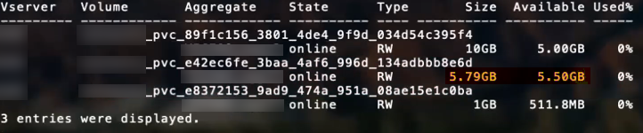

= ONTAP SAN-Konfigurationsoptionen und -Beispiele
:hardbreaks:
:allow-uri-read: 
:icons: font
:imagesdir: ../media/

Erfahren Sie, wie Sie mit Ihrer Installation von Astra Trident ONTAP SAN-Treiber erstellen und verwenden. Dieser Abschnitt enthält Beispiele für die Back-End-Konfiguration und Details zur Zuordnung von Back-Ends zu StorageClasses.

== Back-End-Konfigurationsoptionen

Die Back-End-Konfigurationsoptionen finden Sie in der folgenden Tabelle:

[cols="3"]
|===
| Parameter | Beschreibung | Standard 

| `version` |  | Immer 1 

| `storageDriverName` | Name des Speichertreibers | „ontap-nas“, „ontap-nas-Economy“, „ontap-nas-flexgroup“, „ontap-san“, „ontap-san-Economy“ 

| `backendName` | Benutzerdefinierter Name oder das Storage-Backend | Treibername + „_“ + DatenLIF 

| `managementLIF` | IP-Adresse eines Clusters oder SVM-Management-LIF für nahtlose MetroCluster-Umschaltung müssen Sie eine SVM-Management-LIF angeben. Es kann ein vollständig qualifizierter Domänenname (FQDN) angegeben werden. Kann so eingestellt werden, dass IPv6-Adressen verwendet werden, wenn Astra Trident mit installiert wurde `--use-ipv6` Flagge. IPv6-Adressen müssen in eckigen Klammern definiert werden, z. B. [28e8:d9fb:a825:b7bf:69a8:d02f:9e7b:3555]. | „10.0.0.1“, „[2001:1234:abcd::fefe]“ 

| `dataLIF` | IP-Adresse des LIF-Protokolls. *Nicht für iSCSI angeben.* Astra Trident verwendet link:https://docs.netapp.com/us-en/ontap/san-admin/selective-lun-map-concept.html["ONTAP selektive LUN-Zuordnung"^] Um die iSCI LIFs zu ermitteln, die für die Einrichtung einer Multi-Path-Sitzung erforderlich sind. Wenn eine Warnung erzeugt wird `dataLIF` Ist explizit definiert. | Abgeleitet von SVM 

| `useCHAP` | Verwenden Sie CHAP, um iSCSI für ONTAP-SAN-Treiber zu authentifizieren [Boolesch]. Auf einstellen `true` Damit Astra Trident bidirektionales CHAP als Standardauthentifizierung für die im Backend angegebene SVM konfiguriert und verwendet. Siehe link:ontap-san-prep.html["Vorbereiten der Konfiguration des Back-End mit ONTAP-SAN-Treibern"] Entsprechende Details. | Falsch 

| `chapInitiatorSecret` | CHAP-Initiatorschlüssel. Erforderlich, wenn `useCHAP=true` | „“ 

| `labels` | Satz willkürlicher JSON-formatierter Etiketten für Volumes | „“ 

| `chapTargetInitiatorSecret` | Schlüssel für CHAP-Zielinitiator. Erforderlich, wenn `useCHAP=true` | „“ 

| `chapUsername` | Eingehender Benutzername. Erforderlich, wenn `useCHAP=true` | „“ 

| `chapTargetUsername` | Zielbenutzername. Erforderlich, wenn `useCHAP=true` | „“ 

| `clientCertificate` | Base64-codierter Wert des Clientzertifikats. Wird für zertifikatbasierte Authentifizierung verwendet | „“ 

| `clientPrivateKey` | Base64-kodierte Wert des privaten Client-Schlüssels. Wird für zertifikatbasierte Authentifizierung verwendet | „“ 

| `trustedCACertificate` | Base64-kodierte Wert des vertrauenswürdigen CA-Zertifikats. Optional Wird für die zertifikatbasierte Authentifizierung verwendet. | „“ 

| `username` | Benutzername für die Kommunikation mit dem ONTAP Cluster erforderlich. Wird für die Anmeldeinformationsbasierte Authentifizierung verwendet. | „“ 

| `password` | Passwort, das für die Kommunikation mit dem ONTAP Cluster erforderlich ist. Wird für die Anmeldeinformationsbasierte Authentifizierung verwendet. | „“ 

| `svm` | Zu verwendende Storage Virtual Machine | Abgeleitet wenn eine SVM `managementLIF` Angegeben ist 

| `igroupName` | Der Name der Initiatorgruppe für die zu verwendenden SAN Volumes. Siehe  Finden Sie weitere Informationen. | „Trident-<Backend-UUID>“ 

| `storagePrefix` | Das Präfix wird beim Bereitstellen neuer Volumes in der SVM verwendet. Kann später nicht mehr geändert werden. Um diesen Parameter zu aktualisieren, müssen Sie ein neues Backend erstellen. | „Dreizack“ 

| `limitAggregateUsage` | Bereitstellung fehlgeschlagen, wenn die Nutzung über diesem Prozentsatz liegt. Wenn Sie ein Amazon FSX für das NetApp ONTAP-Back-End verwenden, geben Sie diese bitte nicht an  `limitAggregateUsage`. Die vorhanden `fsxadmin` Und `vsadmin` Enthalten Sie nicht die erforderlichen Berechtigungen, um die Aggregatnutzung abzurufen und sie mit Astra Trident zu begrenzen. | „“ (nicht standardmäßig durchgesetzt) 

| `limitVolumeSize` | Bereitstellung fehlgeschlagen, wenn die angeforderte Volume-Größe über diesem Wert liegt. Schränkt auch die maximale Größe der Volumes ein, die es für qtrees und LUNs managt. | „“ (nicht standardmäßig durchgesetzt) 

| `lunsPerFlexvol` | Die maximale Anzahl an LUNs pro FlexVol muss im Bereich [50, 200] liegen. | „100“ 

| `debugTraceFlags` | Fehler-Flags bei der Fehlerbehebung beheben. Beispiel: { „API“:false, „Methode“:true} Verwenden Sie nur, wenn Sie eine Fehlerbehebung durchführen und einen detaillierten Logdump benötigen. | Null 

| `useREST` | Boolescher Parameter zur Verwendung von ONTAP REST-APIs. *Technische Vorschau*
`useREST` Wird als **Tech-Vorschau bereitgestellt**, das für Testumgebungen und nicht für Produktions-Workloads empfohlen wird. Wenn eingestellt auf `true`, Astra Trident wird ONTAP REST APIs zur Kommunikation mit dem Backend verwenden. Diese Funktion erfordert ONTAP 9.11.1 und höher. Darüber hinaus muss die verwendete ONTAP-Login-Rolle Zugriff auf den haben `ontap` Applikation. Dies wird durch die vordefinierte zufrieden `vsadmin` Und `cluster-admin` Rollen:
`useREST` Wird mit MetroCluster nicht unterstützt. | Falsch 
|===

=== Details zu `igroupName`

`igroupName` Kann auf eine Initiatorgruppe festgelegt werden, die bereits auf dem ONTAP Cluster erstellt wurde. Wenn nicht angegeben, erstellt Astra Trident automatisch eine igroup mit dem Namen `trident-<backend-UUID>`.

Bei Bereitstellung eines vordefinierten igroupName empfehlen wir die Verwendung einer Initiatorgruppe pro Kubernetes Cluster, sofern die SVM zwischen Umgebungen gemeinsam genutzt werden soll. Dies ist notwendig, damit Astra Trident automatisch IQN-Ergänzungen und -Löschungen pflegt.

* `igroupName` Kann aktualisiert werden, um auf eine neue igroup zu verweisen, die auf der SVM außerhalb des Astra Trident erstellt und gemanagt wird.
* `igroupName` Kann weggelassen werden. In diesem Fall wird Astra Trident eine igroup mit dem Namen erstellen und verwalten `trident-<backend-UUID>` Automatisch

In beiden Fällen können Sie weiterhin auf Volume-Anhänge zugreifen. Zukünftige Volume-Anhänge verwenden die aktualisierte Initiatorgruppe. Dieses Update wird den Zugriff auf Volumes im Backend nicht unterbrechen.

== Back-End-Konfigurationsoptionen für die Bereitstellung von Volumes

Sie können die Standardbereitstellung mit diesen Optionen im steuern `defaults` Abschnitt der Konfiguration. Ein Beispiel finden Sie unten in den Konfigurationsbeispielen.

[cols="3"]
|===
| Parameter | Beschreibung | Standard 

| `spaceAllocation` | Speicherplatzzuweisung für LUNs | „Wahr“ 

| `spaceReserve` | Space Reservation Mode; „none“ (Thin) oder „Volume“ (Thick) | „Keine“ 

| `snapshotPolicy` | Die Snapshot-Richtlinie zu verwenden | „Keine“ 

| `qosPolicy` | QoS-Richtliniengruppe zur Zuweisung für erstellte Volumes Wählen Sie eine der qosPolicy oder adaptiveQosPolicy pro Storage Pool/Backend. Die Verwendung von QoS Policy Groups mit Astra Trident erfordert ONTAP 9.8 oder höher. Wir empfehlen die Verwendung einer nicht gemeinsam genutzten QoS-Richtliniengruppe und stellen sicher, dass die Richtliniengruppe auf jede Komponente einzeln angewendet wird. Eine Richtliniengruppe für Shared QoS führt zur Durchsetzung der Obergrenze für den Gesamtdurchsatz aller Workloads. | „“ 

| `adaptiveQosPolicy` | Adaptive QoS-Richtliniengruppe mit Zuordnung für erstellte Volumes Wählen Sie eine der qosPolicy oder adaptiveQosPolicy pro Storage Pool/Backend | „“ 

| `snapshotReserve` | Prozentsatz des für Snapshots reservierten Volumens „0“ | Wenn `snapshotPolicy` Ist „keine“, sonst „“ 

| `splitOnClone` | Teilen Sie einen Klon bei der Erstellung von seinem übergeordneten Objekt auf | „Falsch“ 

| `encryption` | Aktivieren Sie NetApp Volume Encryption (NVE) auf dem neuen Volume, standardmäßig aktiviert `false`. NVE muss im Cluster lizenziert und aktiviert sein, damit diese Option verwendet werden kann. Wenn NAE auf dem Backend aktiviert ist, wird jedes im Astra Trident bereitgestellte Volume NAE aktiviert. Weitere Informationen finden Sie unter: link:../trident-reco/security-reco.html["Astra Trident arbeitet mit NVE und NAE zusammen"]. | „Falsch“ 

| `luksEncryption` | Aktivieren Sie die LUKS-Verschlüsselung. Siehe link:../trident-reco/security-luks.html["Linux Unified Key Setup (LUKS) verwenden"]. | „“ 

| `securityStyle` | Sicherheitstyp für neue Volumes | `unix` 

| `tieringPolicy` | Tiering-Richtlinie zur Verwendung von „keiner“ | „Nur Snapshot“ für eine ONTAP 9.5 SVM-DR-Konfiguration 
|===

=== Beispiele für die Volume-Bereitstellung

Hier ist ein Beispiel mit definierten Standardeinstellungen:

[listing]
----
---
version: 1
storageDriverName: ontap-san
managementLIF: 10.0.0.1
svm: trident_svm
username: admin
password: password
labels:
  k8scluster: dev2
  backend: dev2-sanbackend
storagePrefix: alternate-trident
igroupName: custom
debugTraceFlags:
  api: false
  method: true
defaults:
  spaceReserve: volume
  qosPolicy: standard
  spaceAllocation: 'false'
  snapshotPolicy: default
  snapshotReserve: '10'

----

NOTE: Für alle mit dem erstellten Volumes `ontap-san` Treiber: Astra Trident fügt der FlexVol zusätzliche Kapazität von 10 % hinzu, um die LUN-Metadaten zu bewältigen. Die LUN wird genau mit der Größe bereitgestellt, die der Benutzer in der PVC anfordert. Astra Trident fügt 10 Prozent zum FlexVol hinzu (wird in ONTAP als verfügbare Größe dargestellt). Benutzer erhalten jetzt die Menge an nutzbarer Kapazität, die sie angefordert haben. Diese Änderung verhindert auch, dass LUNs schreibgeschützt werden, sofern der verfügbare Speicherplatz nicht vollständig genutzt wird. Dies gilt nicht für die Wirtschaft von ontap-san.

Für Back-Ends, die definieren `snapshotReserve`, Astra Trident berechnet die Größe der Volumes wie folgt:

[listing]
----
Total volume size = [(PVC requested size) / (1 - (snapshotReserve percentage) / 100)] * 1.1
----
Das 1.1 ist der zusätzliche 10-Prozent-Astra Trident fügt dem FlexVol hinzu, um die LUN-Metadaten zu bewältigen. Für `snapshotReserve` = 5 %, und die PVC-Anforderung = 5 gib, die Gesamtgröße des Volumes beträgt 5,79 gib und die verfügbare Größe 5,5 gib. Der `volume show` Der Befehl sollte Ergebnisse anzeigen, die diesem Beispiel ähnlich sind:

Die Größenanpassung ist derzeit die einzige Möglichkeit, die neue Berechnung für ein vorhandenes Volume zu verwenden.

== Minimale Konfigurationsbeispiele

Die folgenden Beispiele zeigen grundlegende Konfigurationen, bei denen die meisten Parameter standardmäßig belassen werden. Dies ist der einfachste Weg, ein Backend zu definieren.

NOTE: Wenn Sie Amazon FSX auf NetApp ONTAP mit Astra Trident verwenden, empfiehlt es sich, DNS-Namen für LIFs anstelle von IP-Adressen anzugeben.

=== `ontap-san` Treiber mit zertifikatbasierter Authentifizierung

Dies ist ein minimales Beispiel für die Back-End-Konfiguration. `clientCertificate`, `clientPrivateKey`, und `trustedCACertificate` (Optional, wenn Sie eine vertrauenswürdige CA verwenden) werden ausgefüllt `backend.json` Und nehmen Sie die base64-kodierten Werte des Clientzertifikats, des privaten Schlüssels und des vertrauenswürdigen CA-Zertifikats.

[listing]
----
---
version: 1
storageDriverName: ontap-san
backendName: DefaultSANBackend
managementLIF: 10.0.0.1
svm: svm_iscsi
useCHAP: true
chapInitiatorSecret: cl9qxIm36DKyawxy
chapTargetInitiatorSecret: rqxigXgkesIpwxyz
chapTargetUsername: iJF4heBRT0TCwxyz
chapUsername: uh2aNCLSd6cNwxyz
igroupName: trident
clientCertificate: ZXR0ZXJwYXB...ICMgJ3BhcGVyc2
clientPrivateKey: vciwKIyAgZG...0cnksIGRlc2NyaX
trustedCACertificate: zcyBbaG...b3Igb3duIGNsYXNz
----

=== `ontap-san` Treiber mit bidirektionalem CHAP

Dies ist ein minimales Beispiel für die Back-End-Konfiguration. Mit dieser Grundkonfiguration wird ein erstellt `ontap-san` Back-End mit `useCHAP` Auf einstellen `true`.

[listing]
----
---
version: 1
storageDriverName: ontap-san
managementLIF: 10.0.0.1
svm: svm_iscsi
labels:
  k8scluster: test-cluster-1
  backend: testcluster1-sanbackend
useCHAP: true
chapInitiatorSecret: cl9qxIm36DKyawxy
chapTargetInitiatorSecret: rqxigXgkesIpwxyz
chapTargetUsername: iJF4heBRT0TCwxyz
chapUsername: uh2aNCLSd6cNwxyz
igroupName: trident
username: vsadmin
password: password
----

=== `ontap-san-economy` Treiber

[listing]
----
---
version: 1
storageDriverName: ontap-san-economy
managementLIF: 10.0.0.1
svm: svm_iscsi_eco
useCHAP: true
chapInitiatorSecret: cl9qxIm36DKyawxy
chapTargetInitiatorSecret: rqxigXgkesIpwxyz
chapTargetUsername: iJF4heBRT0TCwxyz
chapUsername: uh2aNCLSd6cNwxyz
igroupName: trident
username: vsadmin
password: password
----

== Beispiele für Back-Ends mit virtuellen Pools

In der unten gezeigten Beispiel-Back-End-Definitionsdatei werden bestimmte Standardeinstellungen für alle Storage Pools festgelegt, z. B. `spaceReserve` Bei keiner, `spaceAllocation` Bei false, und `encryption` Bei false. Die virtuellen Pools werden im Abschnitt Speicher definiert.

Astra Trident setzt Provisioning-Labels im Bereich „Comments“. Kommentare werden auf dem FlexVol gesetzt. Astra Trident kopiert alle Labels auf einem virtuellen Pool auf das Storage-Volume während der Bereitstellung. Storage-Administratoren können Labels je virtuellen Pool definieren und Volumes nach Label gruppieren.

In diesem Beispiel legt ein Teil des Speicherpools seine eigenen fest `spaceReserve`, `spaceAllocation`, und `encryption` Werte und einige Pools überschreiben die oben festgelegten Standardwerte.

[listing]
----
---
version: 1
storageDriverName: ontap-san
managementLIF: 10.0.0.1
svm: svm_iscsi
useCHAP: true
chapInitiatorSecret: cl9qxIm36DKyawxy
chapTargetInitiatorSecret: rqxigXgkesIpwxyz
chapTargetUsername: iJF4heBRT0TCwxyz
chapUsername: uh2aNCLSd6cNwxyz
igroupName: trident
username: vsadmin
password: password
defaults:
  spaceAllocation: 'false'
  encryption: 'false'
  qosPolicy: standard
labels:
  store: san_store
  kubernetes-cluster: prod-cluster-1
region: us_east_1
storage:
- labels:
    protection: gold
    creditpoints: '40000'
  zone: us_east_1a
  defaults:
    spaceAllocation: 'true'
    encryption: 'true'
    adaptiveQosPolicy: adaptive-extreme
- labels:
    protection: silver
    creditpoints: '20000'
  zone: us_east_1b
  defaults:
    spaceAllocation: 'false'
    encryption: 'true'
    qosPolicy: premium
- labels:
    protection: bronze
    creditpoints: '5000'
  zone: us_east_1c
  defaults:
    spaceAllocation: 'true'
    encryption: 'false'
----
Hier ist ein iSCSI-Beispiel für das `ontap-san-economy` Treiber:

[listing]
----
---
version: 1
storageDriverName: ontap-san-economy
managementLIF: 10.0.0.1
svm: svm_iscsi_eco
useCHAP: true
chapInitiatorSecret: cl9qxIm36DKyawxy
chapTargetInitiatorSecret: rqxigXgkesIpwxyz
chapTargetUsername: iJF4heBRT0TCwxyz
chapUsername: uh2aNCLSd6cNwxyz
igroupName: trident
username: vsadmin
password: password
defaults:
  spaceAllocation: 'false'
  encryption: 'false'
labels:
  store: san_economy_store
region: us_east_1
storage:
- labels:
    app: oracledb
    cost: '30'
  zone: us_east_1a
  defaults:
    spaceAllocation: 'true'
    encryption: 'true'
- labels:
    app: postgresdb
    cost: '20'
  zone: us_east_1b
  defaults:
    spaceAllocation: 'false'
    encryption: 'true'
- labels:
    app: mysqldb
    cost: '10'
  zone: us_east_1c
  defaults:
    spaceAllocation: 'true'
    encryption: 'false'
----

== Back-Ends StorageClasses zuordnen

Die folgenden StorageClass-Definitionen beziehen sich auf die oben genannten virtuellen Pools. Verwenden der `parameters.selector` Feld gibt in jeder StorageClass an, welche virtuellen Pools zum Hosten eines Volumes verwendet werden können. Auf dem Volume werden die Aspekte im ausgewählten virtuellen Pool definiert.

* Die erste StorageClass (`protection-gold`) Wird dem ersten, zweiten virtuellen Pool im zugeordnet `ontap-nas-flexgroup` Back-End und der erste virtuelle Pool im `ontap-san` Back-End: Dies sind die einzigen Pools, die Schutz auf Goldebene bieten.
* Die zweite StorageClass (`protection-not-gold`) Wird dem dritten, vierten virtuellen Pool in zugeordnet `ontap-nas-flexgroup` Back-End und der zweite, dritte virtuelle Pool in `ontap-san` Back-End: Dies sind die einzigen Pools, die Schutz Level nicht Gold bieten.
* Die dritte StorageClass (`app-mysqldb`) Wird dem vierten virtuellen Pool in zugeordnet `ontap-nas` Back-End und der dritte virtuelle Pool in `ontap-san-economy` Back-End: Dies sind die einzigen Pools, die eine Storage-Pool-Konfiguration für die mysqldb-Typ-App bieten.
* Die vierte StorageClass (`protection-silver-creditpoints-20k`) Wird dem dritten virtuellen Pool in zugeordnet `ontap-nas-flexgroup` Back-End und der zweite virtuelle Pool in `ontap-san` Back-End: Dies sind die einzigen Pools, die Gold-Level-Schutz mit 20000 Kreditpunkten bieten.
* Die fünfte StorageClass (`creditpoints-5k`) Wird dem zweiten virtuellen Pool in zugeordnet `ontap-nas-economy` Back-End und der dritte virtuelle Pool in `ontap-san` Back-End: Dies sind die einzigen Poolangebote mit 5000 Kreditpunkten.

Astra Trident entscheidet, welcher virtuelle Pool ausgewählt wird und stellt sicher, dass die Storage-Anforderungen erfüllt werden.

[listing]
----
apiVersion: storage.k8s.io/v1
kind: StorageClass
metadata:
  name: protection-gold
provisioner: netapp.io/trident
parameters:
  selector: "protection=gold"
  fsType: "ext4"
---
apiVersion: storage.k8s.io/v1
kind: StorageClass
metadata:
  name: protection-not-gold
provisioner: netapp.io/trident
parameters:
  selector: "protection!=gold"
  fsType: "ext4"
---
apiVersion: storage.k8s.io/v1
kind: StorageClass
metadata:
  name: app-mysqldb
provisioner: netapp.io/trident
parameters:
  selector: "app=mysqldb"
  fsType: "ext4"
---
apiVersion: storage.k8s.io/v1
kind: StorageClass
metadata:
  name: protection-silver-creditpoints-20k
provisioner: netapp.io/trident
parameters:
  selector: "protection=silver; creditpoints=20000"
  fsType: "ext4"
---
apiVersion: storage.k8s.io/v1
kind: StorageClass
metadata:
  name: creditpoints-5k
provisioner: netapp.io/trident
parameters:
  selector: "creditpoints=5000"
  fsType: "ext4"
----