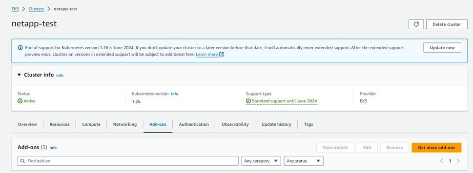

= Konfiguration des Astra Trident EKS Add-On Version 23.10 im EKS Cluster
:hardbreaks:
:allow-uri-read: 
:icons: font
:imagesdir: ../media/

[role="lead"]
Astra Trident optimiert das Amazon FSX für NetApp ONTAP Storage-Management in Kubernetes, damit sich Ihre Entwickler und Administratoren voll und ganz auf den Applikationseinsatz konzentrieren können. Das Add-on für Astra Trident EKS enthält die neuesten Sicherheits-Patches und Bug Fixes. Es wurde von AWS für die Zusammenarbeit mit Amazon EKS validiert. Mit dem EKS-Add-on können Sie sicherstellen, dass Ihre Amazon EKS-Cluster sicher und stabil sind und den Arbeitsaufwand für die Installation, Konfiguration und Aktualisierung von Add-Ons verringern.

== Voraussetzungen

Stellen Sie vor dem Konfigurieren des Astra Trident Add-ons für AWS EKS sicher, dass folgende Voraussetzungen erfüllt sind:

* Ein Amazon EKS Cluster-Konto mit Add-on-Abonnement
* AWS Berechtigungen für den AWS Marketplace:
`"aws-marketplace:ViewSubscriptions",
"aws-marketplace:Subscribe",
"aws-marketplace:Unsubscribe`
* AMI-Typ: Amazon Linux 2 (AL2_x86_64) oder Amazon Linux 2 Arm(AL2_ARM_64)
* Knotentyp: AMD oder ARM
* Ein bestehendes Amazon FSX für NetApp ONTAP-Filesystem

== Schritte

. Navigieren Sie auf Ihrem EKS Kubernetes-Cluster zur Registerkarte *Add-ons*.
+

. Gehen Sie zu *AWS Marketplace Add-ons* und wählen Sie die Kategorie _Storage_.
+

. Suchen Sie *AstraTrident by NetApp* und aktivieren Sie das Kontrollkästchen für das Astra Trident Add-on.
. Wählen Sie die gewünschte Version des Add-ons aus.
+

. Wählen Sie die Option IAM-Rolle aus, die vom Knoten übernommen werden soll.
. Konfigurieren Sie die gewünschten optionalen Einstellungen, und wählen Sie *Weiter*.
+

. Wählen Sie *Erstellen*.
. Überprüfen Sie, ob der Status des Add-ons _Active_ lautet.
+

== Installieren/deinstallieren Sie das Astra Trident EKS Add-on über CLI

.Installation des Astra Trident EKS Add-On über CLI:
Im folgenden Beispiel wird das Add-on für Astra Trident EKS installiert:
`eksctl create addon --cluster K8s-arm --name netapp_trident-operator --version v23.10.0-eksbuild.`
`eksctl create addon --cluster K8s-arm --name netapp_trident-operator --version v23.10.0-eksbuild.1` (Mit einer dedizierten Version)

.Deinstallieren Sie das Astra Trident EKS-Add-On über CLI:
Mit dem folgenden Befehl wird das Astra Trident EKS Add-on deinstalliert:
`eksctl delete addon --cluster K8s-arm --name netapp_trident-operator`
